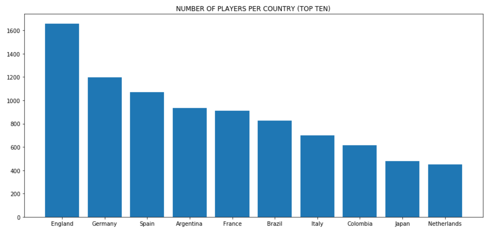
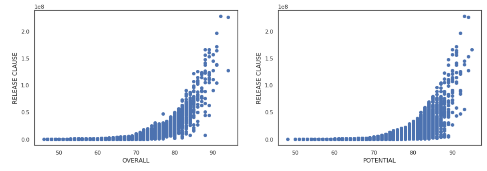
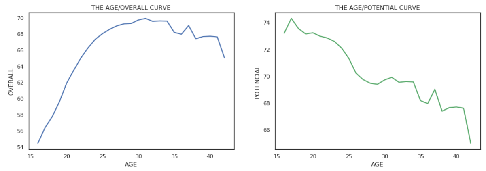

# Fifa2019_Analysis
Data analysis of Fifa 2019 database

Fifa 2019 database contains 18206 players registered. Some of these entries contain missing and wrong information. To perform data analysis, firstly data cleansing and uniformization was performed. To analyze the data some models and resulting graphs were created. The following figures present some result examples.

